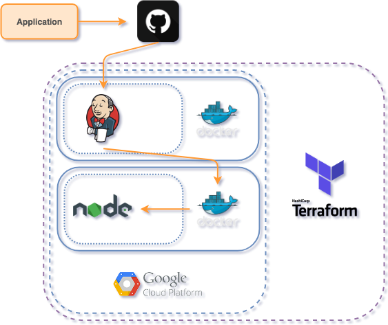

# Terraform Provisioning Solution
Terraform provisioning solution for timeoff-management application. This will create:
1. CI/CD instance running containarized Jenkins with pre-configured job for application deployment.
2. Application instance running containarized nodejs with first deployed application.

## Aplication Diagram
In order to understand better the provided solution, here is the architecture diagram:


## Initial Set-Up
1. Make sure your Google Cloud Platform key is in place:
```
export GOOGLE_CREDENTIALS=$(cat path/to/your/key.json)
```
2. Edit the variables in main.tf with your ssh credentials and private key path:
```
#Setting up connection variables
variable "connection_type" {
  default = "ssh"
}
variable "connection_user" {
  default = "yourusername"
}
variable "connection_private_key" {
  default = "/path/to/your/private/key.local"
}
```
## Running instructions
First, make sure you have [terraform](https://www.terraform.io/) installed locally on your machine. Then, fetch the repo and execute:
```
terraform init
terraform apply
```
